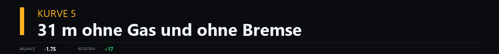

# iRacing Telemetrie-Coach

Live-Telemetrie-Coaching für iRacing. Schneidet jede Runde aus dem Shared
Memory mit, vergleicht sie mit deiner Bestrunde und sagt dir nach der
Zieldurchfahrt **eine** konkrete Anweisung — per Sprachausgabe und im Overlay.



Alles läuft lokal. Der Webserver hört ausschließlich auf `127.0.0.1`, es
verlässt nichts den Rechner.

## Was es kann

- **Sprachansage nach jeder Runde** — eine Kurve, eine Maßnahme, rund drei
  Sekunden. Keine Zeiten, die stehen im Lenkrad-Dashboard.
- **VR-Overlay** mit Brems- und Gasmarkern → [Details und Bilder](docs/OVERLAY.md)
- **Dashboard** mit Delta-Verlauf, Geschwindigkeits- und Pedalvergleich,
  Streckenkarte und Abschnittstabelle
- **Bremsbalance-Bewertung** aus dem Rotationsüberschuss beim Anbremsen
- **Linienvergleich** über GPS, auf Zentimeter gegen die Referenzrunde
- **Gegnerdaten** — Verkehr je Runde, Abstand zum Vordermann, Bestzeiten aller
  Fahrer
- **Stint-Auswertungen** nach der Session, mit Setup-Vergleich aus der
  `.ibt`-Datei

## Installation

```bash
python -m pip install pyirsdk numpy scipy pyyaml pillow
```

In `Documents\iRacing\app.ini`:

```
irsdkEnableMem=1        ; Live-Telemetrie (Pflicht)
irsdkEnableDisk=1       ; .ibt-Dateien
irsdkAutoLogDisk=1      ; automatisch aufzeichnen
irsdkLogSetup=1         ; Setup mitschreiben
```

Als Claude-Code-Skill: den Ordner nach `~/.claude/skills/` legen. Die Skripte
laufen aber auch eigenständig.

## Loslegen

```bash
python live_coach.py --voice Katja --rate 0.95 --gain 10
python server.py --port 8099
```

Dann `http://127.0.0.1:8099` im Browser, `http://127.0.0.1:8099/vr` als
Overlay-URL.

Nach dem Stint:

```bash
python import_session.py --latest    # Linie und Radgeschwindigkeiten nachladen
python session_report.py --latest    # Auswertung
```

Vollständige Anleitung: [SKILL.md](SKILL.md)

## Reifegrad

Entstanden an **einem** Fahrzeug (Porsche 911 Cup 992.2) und **zwei** Strecken,
in etwa zwei Tagen. Rundenschnitt, Deltas, Kurvenerkennung und Linienvergleich
sind gegen echte Daten geprüft. VR-Overlay, Gegnerdaten und einige
Schwellenwerte sind ausdrücklich Versuchsstadium — der Abschnitt *Reifegrad* in
der [SKILL.md](SKILL.md) sagt für jeden Teil, wie belastbar er ist.

Bekannte Grenzen:

- **Nur Windows** — Sprachausgabe und Schriftarten
- Kein Linienvergleich live; die Kanäle fehlen im Shared Memory und kommen
  erst über `import_session.py` aus der `.ibt`-Datei
- Kurvennummern sind die Zählreihenfolge ab Start/Ziel, **nicht** die
  offizielle Streckennummerierung

Rückmeldungen und Issues willkommen, besonders von anderen Fahrzeugen und
Strecken — dort werden die kalibrierten Schwellenwerte vermutlich nicht passen.

## Lizenz

MIT — siehe [LICENSE](LICENSE).
