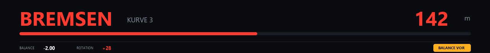
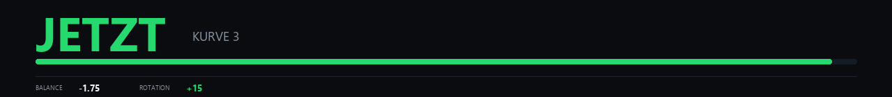

# Das Overlay

Der Server rendert das Overlay als Bildfolge und schiebt sie als MJPEG-Strom
an den Browser. Dadurch braucht die anzeigende Seite **kein JavaScript** — was
nötig ist, weil manche Overlay-Programme keines ausführen.

```
http://127.0.0.1:8099/vr
```

Standardformat ist 1280 × 140, ein flaches Banner. Anpassbar über
`?w=1600&h=180&fps=12`.

---

## Zwischen den Kurven: der Coaching-Hinweis


Nach jeder Zieldurchfahrt steht hier die wichtigste Kurve und die eine
Maßnahme, die dort am meisten bringt. Darunter der zweitgrößte Verlust,
falls die Analyse dort einen benennbaren Fehler findet.

In der Fußzeile die **Bremsbalance** in Cockpit-Einheiten und der
**Rotationsüberschuss** — türkis bei Untersteuern, grün im Zielband, rot bei
Übersteuern.

---

## Beim Anbremsen: der Bremsmarker



300 m vor dem Bremspunkt der Referenzrunde erscheint der Countdown in Metern,
der Balken füllt sich bis zum Punkt. Unter 6 m springt die Anzeige auf ein
großes **JETZT**.

Rechts unten die Balance-Empfehlung: Sie erscheint erst, wenn der
Rotationsüberschuss zwei Runden in Folge außerhalb des Zielbands lag — oder
sofort bei einem extremen Ausschlag, etwa einem blockierenden Hinterrad.

---

## Am Kurvenausgang: der Gasmarker



Nach dem Scheitelpunkt zeigt der grüne Marker, wann die Referenzrunde wieder
aufs Gas geht — mit 100 m Vorlauf statt 300 m, weil beim Herausbeschleunigen
der Moment zählt und nicht die Vorwarnung.

---

## Verzögerung

| | |
|---|---|
| SDK-Abfrage 60 Hz | max. 17 ms = 1,2 m |
| Bildrate 12 fps | max. 83 ms = 5,7 m |
| HTTP über 127.0.0.1 | ~2 ms |

Zusammen also schlimmstenfalls rund 7 m bei 250 km/h, typisch die Hälfte. Wem
der Marker zu spät kommt, kann mit `?lead=8` ein Vorhaltemaß in Metern setzen —
vorsichtig, denn zu viel Vorhalt bringt einen falschen Bremspunkt bei.

**Wichtig:** immer `127.0.0.1` verwenden, nicht `localhost`. Unter Windows
kostet die Namensauflösung sonst rund 200 ms pro Abfrage.

---

## Ohne laufenden Sim einrichten

```
http://127.0.0.1:8099/api/sim?on=1
```

Spielt die Referenzrunde in Echtzeit ab, damit sich Größe und Position in Ruhe
justieren lassen. Mit `?on=0` wieder ausschalten — **vor dem Fahren**, sonst
zeigt das Overlay die Aufzeichnung statt der echten Position.
